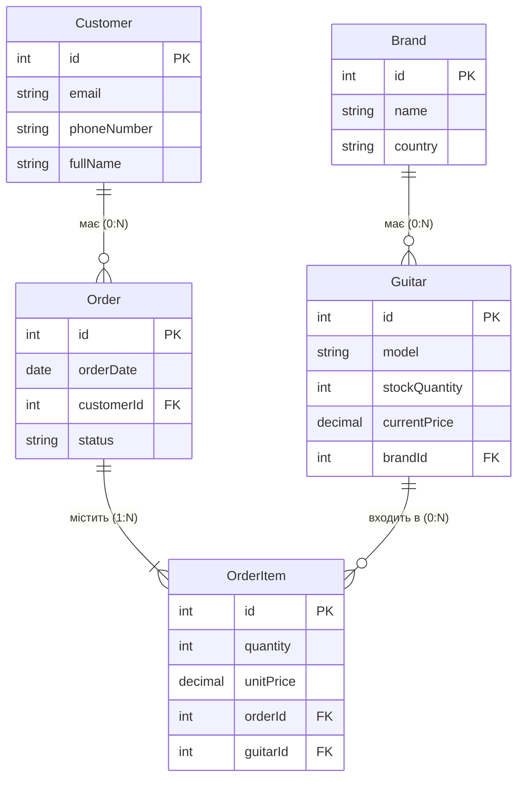

```mermaid
erDiagram
    Customer {
        int id PK
        string email
        string phoneNumber
        string fullName
    }

    Brand {
        int id PK
        string name
        string country
    }

    Guitar {
        int id PK
        string model
        int stockQuantity
        decimal currentPrice
        int brandId FK
    }

    Order {
        int id PK
        date orderDate
        int customerId FK
        string status
    }

    OrderItem {
        int id PK
        int quantity
        decimal unitPrice
        int orderId FK
        int guitarId FK
    }

    Customer ||--o{ Order : "має (0:N)"
    Brand ||--o{ Guitar : "має (0:N)"
    Order ||--|{ OrderItem : "містить (1:N)"
    Guitar ||--o{ OrderItem : "входить в (0:N)"
```
