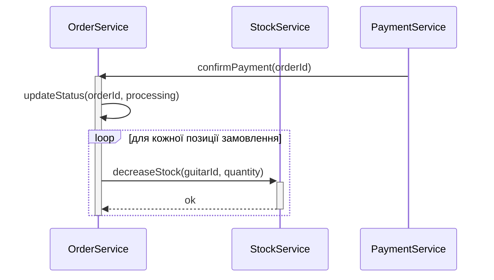
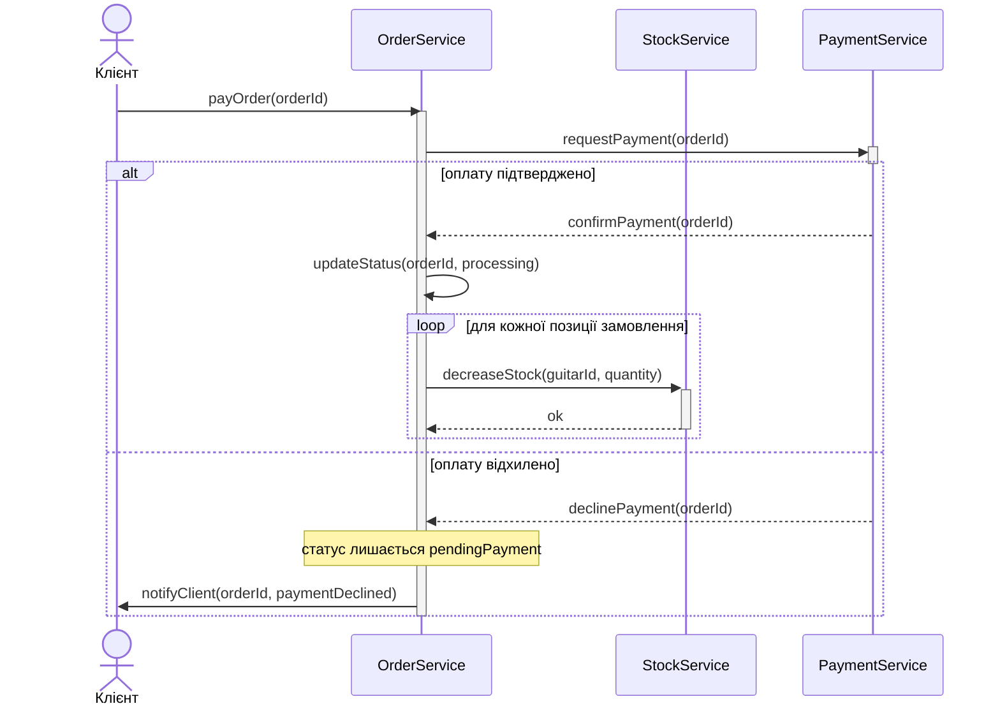
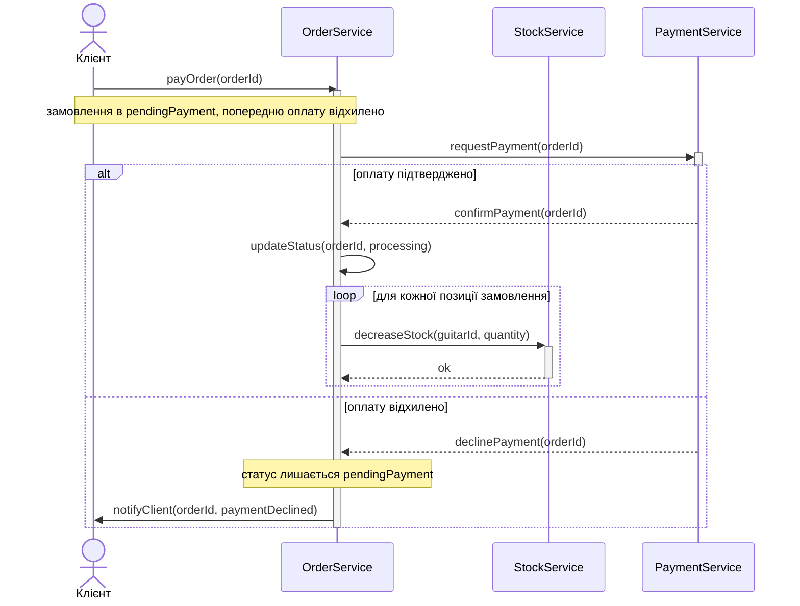
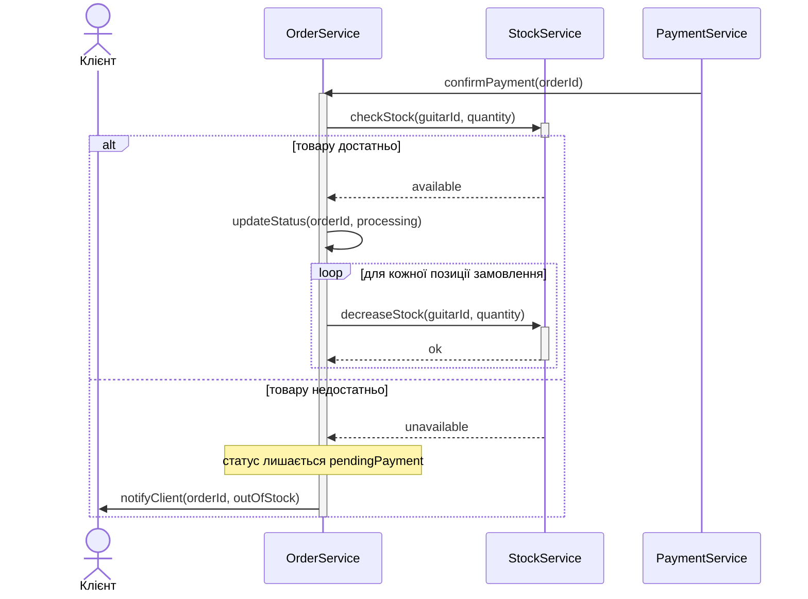

## SC-1 Оплату підтверджено

```mermaid
sequenceDiagram
  participant OrderService
    participant StockService
    participant PaymentService

    PaymentService ->> OrderService: confirmPayment(orderId)
    activate OrderService
    OrderService ->> OrderService: updateStatus(orderId, processing)
    loop для кожної позиції замовлення
        OrderService ->>+ StockService: decreaseStock(guitarId, quantity)
        StockService -->>- OrderService: ok
    end
    deactivate OrderService
```

## SC-2 Оплату відхилено

```mermaid
sequenceDiagram
    actor Клієнт
    participant OrderService
    participant StockService
    participant PaymentService

    Клієнт ->> OrderService: payOrder(orderId)
    activate OrderService
    OrderService ->>+ PaymentService: requestPayment(orderId)
    deactivate PaymentService
    alt оплату підтверджено
        PaymentService -->> OrderService: confirmPayment(orderId)
        OrderService ->> OrderService: updateStatus(orderId, processing)
        loop для кожної позиції замовлення
            OrderService ->>+ StockService: decreaseStock(guitarId, quantity)
            StockService -->>- OrderService: ok
        end
    else оплату відхилено
        PaymentService -->> OrderService: declinePayment(orderId)
        Note over OrderService: статус лишається pendingPayment
        OrderService ->> Клієнт: notifyClient(orderId, paymentDeclined)
    end
    deactivate OrderService
```

## SC-9 Повторна оплата

```mermaid
sequenceDiagram
    actor Клієнт
    participant OrderService
    participant StockService
    participant PaymentService

    Клієнт ->> OrderService: payOrder(orderId)
    activate OrderService
    Note over Клієнт,OrderService: замовлення в pendingPayment, попередню оплату відхилено
    OrderService ->>+ PaymentService: requestPayment(orderId)
    deactivate PaymentService
    alt оплату підтверджено
        PaymentService -->> OrderService: confirmPayment(orderId)
        OrderService ->> OrderService: updateStatus(orderId, processing)
        loop для кожної позиції замовлення
            OrderService ->>+ StockService: decreaseStock(guitarId, quantity)
            StockService -->>- OrderService: ok
        end
    else оплату відхилено
        PaymentService -->> OrderService: declinePayment(orderId)
        Note over OrderService: статус лишається pendingPayment
        OrderService ->> Клієнт: notifyClient(orderId, paymentDeclined)
    end
    deactivate OrderService
```

## SC-10 Нестача товару на момент оплати

```mermaid
sequenceDiagram
    actor Клієнт
    participant OrderService
    participant StockService
    participant PaymentService

    PaymentService ->> OrderService: confirmPayment(orderId)
    activate OrderService
    OrderService ->>+ StockService: checkStock(guitarId, quantity)
    deactivate StockService
    alt товару достатньо
        StockService -->> OrderService: available
        OrderService ->> OrderService: updateStatus(orderId, processing)
        loop для кожної позиції замовлення
            OrderService ->>+ StockService: decreaseStock(guitarId, quantity)
            StockService -->>- OrderService: ok
        end
    else товару недостатньо
        StockService -->> OrderService: unavailable
        Note over OrderService: статус лишається pendingPayment
        OrderService ->> Клієнт: notifyClient(orderId, outOfStock)
    end
    deactivate OrderService
```
