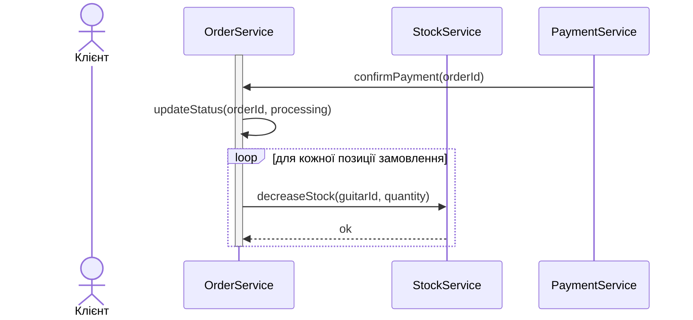
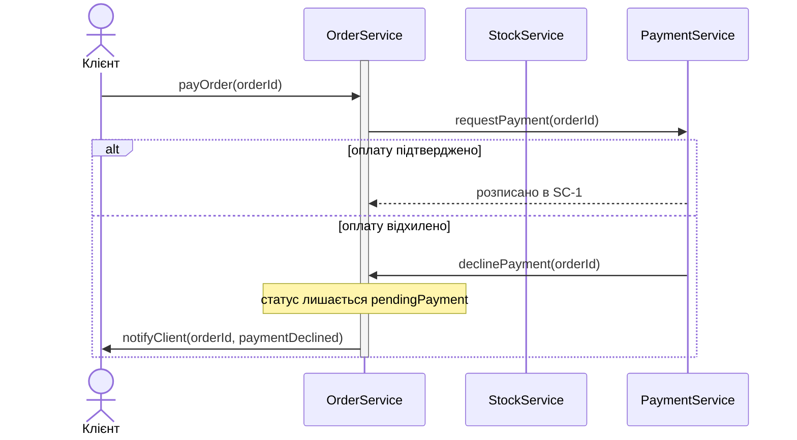
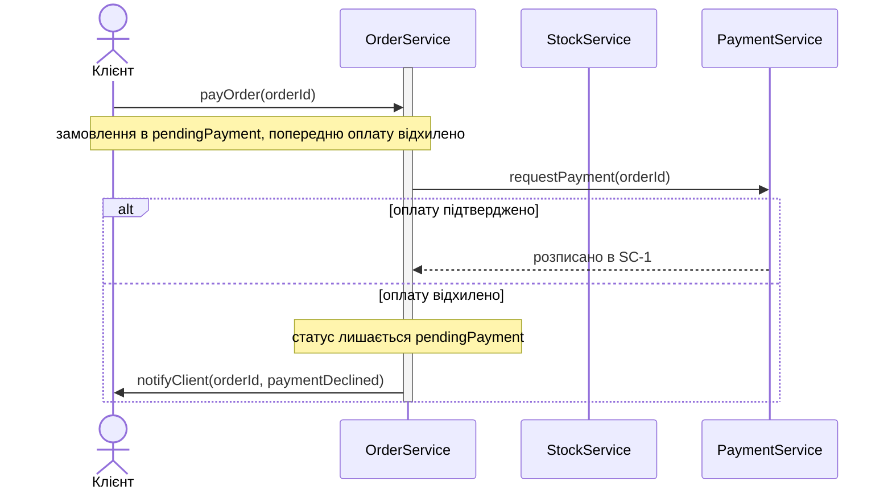
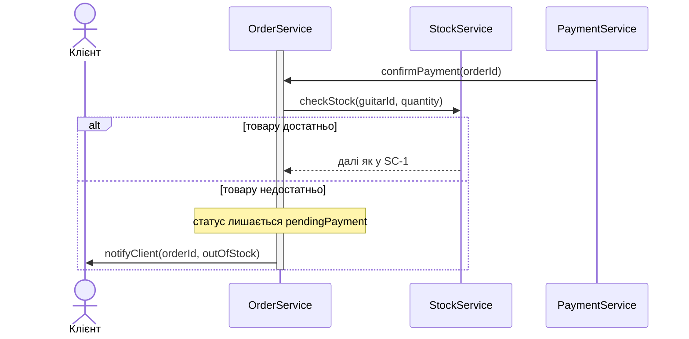

```mermaid
sequenceDiagram
    actor Клієнт
    participant OrderService
    participant StockService
    participant PaymentService

    activate OrderService
    PaymentService ->> OrderService: confirmPayment(orderId)
    OrderService ->> OrderService: updateStatus(orderId, processing)
    loop для кожної позиції замовлення
        OrderService ->> StockService: decreaseStock(guitarId, quantity)
        StockService -->> OrderService: ok
    end
    deactivate OrderService
```

```mermaid
sequenceDiagram
    actor Клієнт
    participant OrderService
    participant StockService
    participant PaymentService

    activate OrderService
    Клієнт ->> OrderService: payOrder(orderId)
    OrderService ->> PaymentService: requestPayment(orderId)
    alt оплату підтверджено
        PaymentService -->> OrderService: розписано в SC-1
    else оплату відхилено
        PaymentService ->> OrderService: declinePayment(orderId)
        Note over OrderService: статус лишається pendingPayment
        OrderService ->> Клієнт: notifyClient(orderId, paymentDeclined)
    end
    deactivate OrderService
```

```mermaid
sequenceDiagram
    actor Клієнт
    participant OrderService
    participant StockService
    participant PaymentService

    activate OrderService
    Клієнт ->> OrderService: payOrder(orderId)
    Note over Клієнт,OrderService: замовлення в pendingPayment, попередню оплату відхилено
    OrderService ->> PaymentService: requestPayment(orderId)
    alt оплату підтверджено
        PaymentService -->> OrderService: розписано в SC-1
    else оплату відхилено
        Note over OrderService: статус лишається pendingPayment
        OrderService ->> Клієнт: notifyClient(orderId, paymentDeclined)
    end
    deactivate OrderService
```

```mermaid
sequenceDiagram
    actor Клієнт
    participant OrderService
    participant StockService
    participant PaymentService

    activate OrderService
    PaymentService ->> OrderService: confirmPayment(orderId)
    OrderService ->> StockService: checkStock(guitarId, quantity)
    alt товару достатньо
        StockService -->> OrderService: далі як у SC-1
    else товару недостатньо
        Note over OrderService: статус лишається pendingPayment
        OrderService ->> Клієнт: notifyClient(orderId, outOfStock)
    end
    deactivate OrderService
```
    
