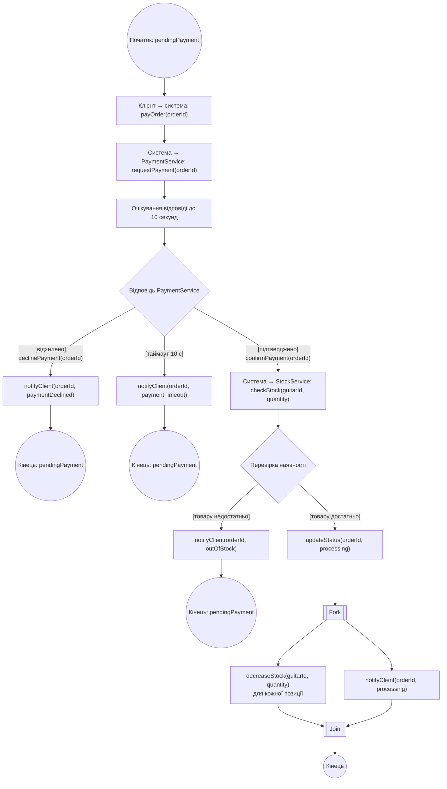

```mermaid
flowchart TD
    Start((Початок: pendingPayment)) --> PayOrder["Клієнт → система: payOrder(orderId)"]
    PayOrder --> ReqPay["Система → PaymentService: requestPayment(orderId)"]
    ReqPay --> Wait["Очікування відповіді до 10 секунд"]
    Wait --> DecPay{"Відповідь PaymentService"}

    DecPay -->|"[підтверджено]<br/>confirmPayment(orderId)"| CheckStock["Система → StockService: checkStock(guitarId, quantity)"]
    DecPay -->|"[відхилено]<br/>declinePayment(orderId)"| NotifyDeclined["notifyClient(orderId, paymentDeclined)"]
    DecPay -->|"[таймаут 10 с]"| NotifyTimeout["notifyClient(orderId, paymentTimeout)"]

    NotifyDeclined --> EndDeclined((Кінець: pendingPayment))
    NotifyTimeout --> EndTimeout((Кінець: pendingPayment))

    CheckStock --> DecStock{"Перевірка наявності"}
    DecStock -->|"[товару недостатньо]"| NotifyOutOfStock["notifyClient(orderId, outOfStock)"]
    NotifyOutOfStock --> EndOutOfStock((Кінець: pendingPayment))

    DecStock -->|"[товару достатньо]"| UpdateStatus["updateStatus(orderId, processing)"]
    UpdateStatus --> Fork[["Fork"]]

    Fork --> DecrStock["decreaseStock(guitarId, quantity)<br/>для кожної позиції"]
    Fork --> NotifyProc["notifyClient(orderId, processing)"]

    DecrStock --> Join[["Join"]]
    NotifyProc --> Join

    Join --> EndSuccess((Кінець))
```
